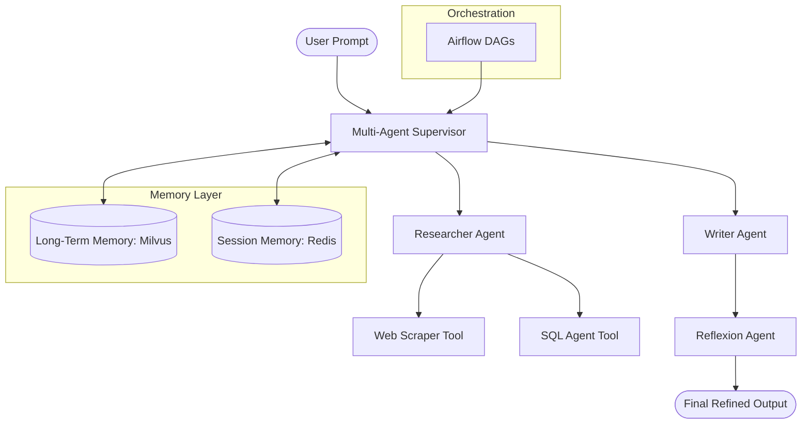

# Agentic-GenAI-Workflows: Enterprise Agentic OS

An enterprise-grade, comprehensive "Autonomous Agentic OS" for building, scaling, and managing autonomous agentic workflows. This system integrates advanced reasoning patterns, persistent long-term memory, and robust multi-agent orchestration.

## Technical Architecture



## Feature Deep-Dives

### 1. Reflexion Pattern (Self-Correction Loop)
The `Self-Correcting Agent` implements the **Reflexion** pattern. Unlike standard agents that produce a single output, this agent iteratively critiques its own work and refines it.
- **Thought**: Initial generation based on the prompt.
- **Critique**: Self-evaluation for accuracy, clarity, and completeness.
- **Refine**: Improved version based on the critique.
This loop repeats up to a configurable maximum, ensuring production-grade quality.

### 2. Long-Term Memory (Milvus-Backed)
Context persistence is achieved through a Milvus-backed vector store. This allows agents to:
- Maintain context across multiple sessions.
- Retrieve relevant past information using semantic search.
- Reduce token usage by only injecting highly relevant historical data.

### 3. Professional SQL Agent Tool
A specialized tool for safe and effective database interaction. It leverages SQLAlchemy for broad compatibility and uses LLMs to translate natural language into optimized, safe SQL queries.

### 4. Enterprise Orchestration with Airflow
Complex workflows are managed via Apache Airflow DAGs. This provides:
- Reliable task scheduling and monitoring.
- XCom-based data passing between agents.
- Retry logic and error handling for multi-stage simulation workflows.

## CI/CD and DevOps
The repository includes a comprehensive CI/CD pipeline via GitHub Actions (`infrastructure/github_actions/ci_cd.yml`):
- **Automated Linting**: Uses Ruff for high-performance Python linting.
- **Testing**: Pytest-driven test suite ensures reliability.
- **Deployment**: Automatic DAG deployment to production Airflow environments.

## Directory Structure
- `src/agents/`: Orchestration, Reflexion, and supervisor logic.
- `src/tools/`: SQL Agent, Web Scraper, and custom tools.
- `src/memory/`: Milvus (long-term) and Redis (short-term) management.
- `airflow/dags/`: Production-grade orchestration workflows.
- `infrastructure/`: CI/CD configurations.
- `tests/`: Comprehensive test suites.

## Getting Started

### Prerequisites
- Python 3.10+
- Redis & Milvus
- OpenAI API Key

### Installation
```bash
pip install -r requirements.txt
```

### Usage
Run the self-correcting agent:
```bash
python src/agents/self_correcting_agent.py
```

## Production Standards
*   **Docstrings**: All modules follow Google-style docstring conventions.
*   **Type Hinting**: Full PEP 484 type hint coverage.
*   **Scalability**: Optimized for high-volume token processing and concurrent execution.
